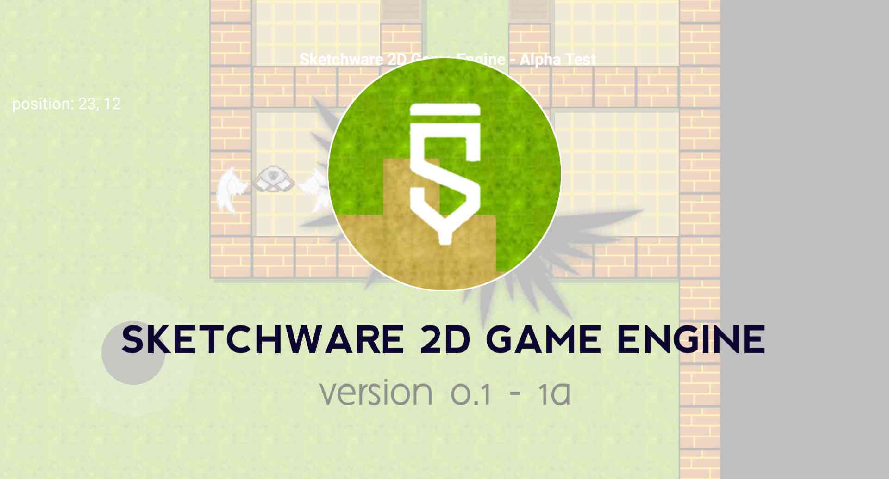
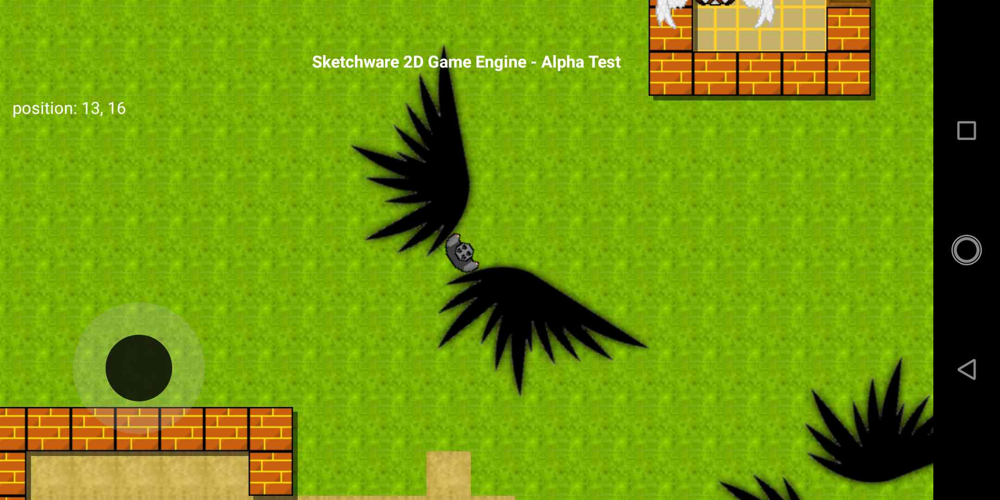
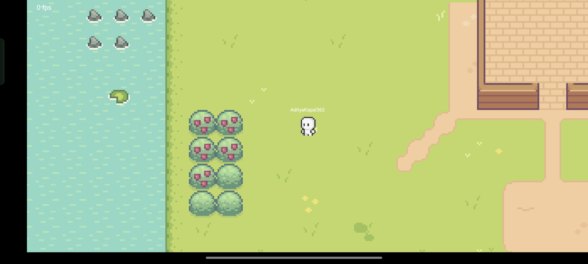
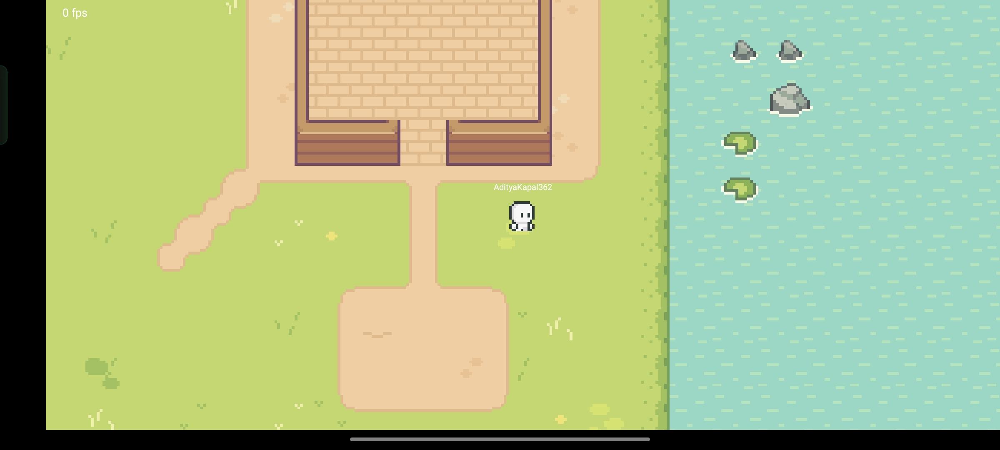

> [!NOTE]
> This library is still under development, some of the codes are not uploaded yet, and the black-grids issue have been fixed yattaaa 🥳

## Welcome
**
Sketchware 2D Game Engine or S2DGE designed to simplify game development within Sketchware, enabling users to create 2D games.
**

Sketchware 2D Game Engine is a framework or toolkit developed within the constraints of Sketchware, a drag-and-drop app builder for Android. It provided the essential tools and functionalities to build 2D games directly in Sketchware by leveraging the platform's block-based coding environment and custom logic.

This engine offered ready-to-use features like sprite animation, collision detection, physics simulation, and event handling, effectively transforming Sketchware into a basic game development platform.

Whether you're a beginner exploring game development or an experienced Sketchware user looking to expand your creativity, this engine provides the tools you need to build exciting 2D games efficiently.

  
  

## How it started
In the middle of january 2020, i was looking for new idea that i can implement in Sketchware. I made too many tools in that day & figured that maybe if make a game it will be great and something new to learn for me. Maintaining SH Recovery also became very boring to me. I was looking for an example projects on Sketchware Community page and found nothing i can learn. I realized something that day, i've played a game named CS2D for years since i was a kid. Then i proceeds to learn game developments on Youtube. Nothing i can learn from there because they uses Unity, where i uses Sketchware. The frustation made me ignored the idea for 3 weeks. After that, i came up with an idea of using FrameLayout as the canvas and ImageView(s) as the TileMap _(i was forgot the reasons why i came up with FrameLayout & ImageView lol)_

Then the story begins that day, on 7th february 2020, i started the development, 1 week full coding with 3 hours sleep each day. Until i released the very first version of Sketchware 2D Game Engine on 23 october 2020. And on December 2024, i decided to make the Github page to prevent this project abandoned again :)

## How It Works
The engine integrates seamlessly into Sketchware by providing pre-configured blocks and templates that allow developers to:
1.  Define game objects and their behaviors.
2.  Add or customize the logic for movement, collisions, and animations.
3.  Test and debug directly within the Sketchware app.
Using custom blocks, the engine handles complex tasks like rendering sprites and calculating collisions, making the development process faster and more beginner-friendly.

## Release
Ofc its empty, dont ask me when to release, but ask me "can i join the development?" instead xD

  Or you can visit <a href="https://web.sketchub.in/p/808">S2DGE on Sketchub</a> for the previous version

> [!IMPORTANT]
> The latest update of Sketchware 2D Game Engine 0.5 may be released at ***the end of December 2024*** on Sketchub within the SGE Studio

## Development (v.0.5)
- [x] Migrated to Canvas & SurfaceView
- [x] New Generate Engine
- [x] Animated TileMap
- [x] Multi-layer TileMap
- [ ] TileMap Shaders
- [x] Multiplayer Support
- [x] Animated Player & Movements
- [x] Collisions feature
- [ ] Basic Physics
- [x] Fix Black-grids issue
- [x] Optimized Render on Thread
- [x] Firebase Database Support
- [ ] Interactive NPCs
- [ ] Documentation (0%)

  
  

> More screenshots of the project progress will be added very soon
